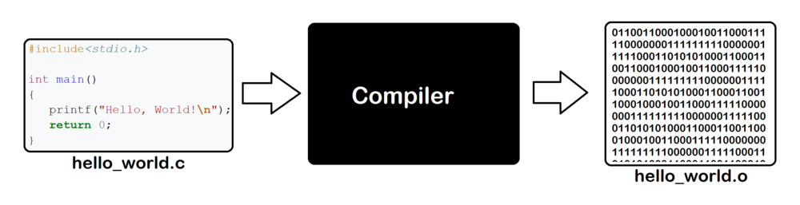
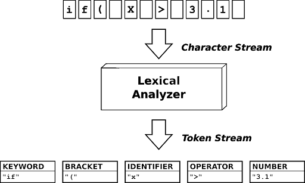

--- 
title: "Compiler Construction"
author: "Noman Javed"
date: "`r format(Sys.time(), '%d %B %Y')`"
site: bookdown::bookdown_site
---

knitr::opts_chunk$set(echo = TRUE, fig.align="center")

# Introduction

Welcome to this adventurous course on Compiler Construction. This course will enable you to revise rather implement a lot of stuff you have covered in earlier courses. By the end of this course you will be able to design and implement a compiler of a simple high level programming language.

## Course Administration

### Protocol for Online Lectures & Discussion
We shall be using Zoom for the online sessions. I shall share the link of the Zoom session on Whatsapp group before the start of every lecture. All other relevant announcements will be made on Whatsapp group. So, I suggest to avoid sharing irrelevant stuff on the Whatsapp group.

I prefer my lectures to be interactive and you will get ample opportunity to share your views, ask questions or answer others questions. However, to avoid unnecessary disturbance and noise, I suggest to turn off your webcams and mute your microphones. You can, however, unmute it any time you want to ask a question.

### Course Assessment
1. Five programming assignments - one for each phase of compilation (30%)
2. Midterm (30%)
3. Final Exam (40%)

### Reference Books
* Engineering a compiler - 2nd Edition
* Introduction to Compilers and Language Design - 2nd Edition

### Softwares and Programming Languages
Python will be used as the implementation language during the course. So, it is your responsibility to have a functional compiler / IDE for python. I shall be using Anaconda for Python and Visual Studio Code as the IDE.

## What is a Compiler?
A software that converts a source program to an executable program. Source program is usually written in a high level language like C, C++, Java or Python etc. Executable program is the machine code that your computer can understand and execute to generate output e.g. a .exe file on windows operating system . 

```{r, echo=FALSE, fig.align='center', fig.cap="Compiler: A source code to machine code translator"}

```

We talk about three languages when we discuss a compiler
1. Source Language: Any high level programming language in which we want to write our programs.
2. Target Language: Language that can be executed on the machine usually the machine language.
3. Implementation Language: Language used to write the code of compiler.

In our case, we will be using
* Classroom object oriented language (COOL) as the source language
* Target language will be the machine language
* Implementation language will be Python


## Why should we study Compiler?
1. To become a better programmer: A compiler is a beautiful combination of theory and practice. You will get a chance to implement various phases of compilation. All these phases comprise of various algorithms and you will implement these algorithms in code. This will sharpen your programming skills and boost your confidence.
2. To create your own tools: Many of the real world applications use one or more of the algorithms implemented in compiler. For example many word processors and code IDE's implement parser to give useful tips to writers. 
3. To implement your own language: There are many situations in which designing a new language is the best solution. These languages are usually called Domain Specific Languages. For example, HTML is a domain specific language use to share information over internet.
4. To contribute to existing compilers: There are many open source compiler projects and hundreds of people are contributing to them to extend the functionality of the compilers. 

## Structure of a Compiler
There are two major parts of a compiler:
1. Front End
2. Back End


```{r, echo=FALSE, fig.align='center', fig.cap="Structure of a compiler"}
knitr::include_graphics("./images/frontend-backend.png")
```


The responsibility of the *front end* is to make sure that source program is error free. So, in case of an error it is its responsibility to inform the programmer about the error and pin point the location of the error. If there are no errors in the source code, front end converts the source code in an intermediate representation (IR). 

*Intermediate representation* is usually a low level language. More on it later.

*Back end* works on the intermediate language code and tries to optimize it for performance. After optimization it generates the executable code that can be executed by the host machine.

## Stages of Compilation
Following are the five main stages of compilation:

1. Lexical Analysis
2. Syntax Analysis
3. Semantic Analysis
4. Code Optimization
5. Code Generation

First three of these are the analysis phase of compilation and are collectively called Front End.
Last two of them are the synthesis phase and are collectively called Back End.

```{r, echo=FALSE, fig.align='center', fig.cap="Stages of a Compiler"}
knitr::include_graphics("./images/stages-of-a-compiler.png")
```

### Lexical Analysis
The job of lexical analyzer is to read the source program, character by character, and converts it into tokens. A token is a minimal unit defined by a language. 

```{r, echo=FALSE, fig.align='center', fig.cap="Lexical Analysis"}

```

The other names used for a lexical analyzer are tokenizer and scanner.

### Syntax Analysis
As is evident from its name, its responsibility is to check the syntax of the source program and verify that it follows the rules prescribed by the grammar. It demands tokens from the lexical analyzer and then constructs a tree usually called abstract syntax tree as an output if there is no syntax error in the code.
```{r, echo=FALSE, fig.align='center', fig.cap="Syntax Analysis"}

```

### Semantic Analysis
Its job is to look for semantic errors in the program. Semantic errors are errors like using a variable without declaring it or type mismatch errors in expressions. If the code is error free, it is converted into an intermediate representation.

### Code Optimization
It looks for opportunities to improve the efficiency of the code. The efficiency can be measures both in terms of the time and memory. This is the most research intensive phase and a lot of researchers work on finding these optimization opportunities. Removing the dead / unreachable code is an example of one such optimization.

### Code Generation
Its role is to convert the optimized intermediate level code to the executable code. Some of its tasks are register allocation and instruction scheduling.


